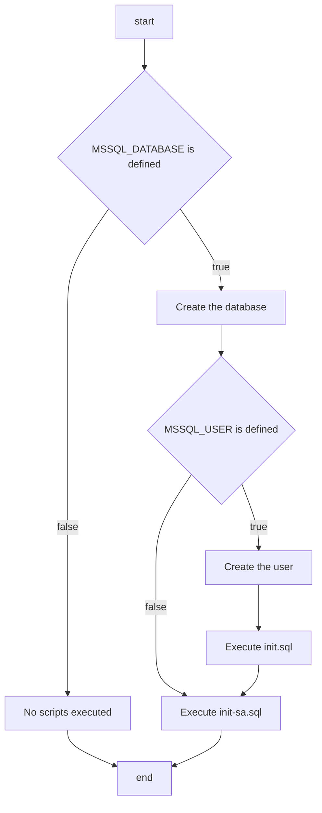

# Reference

This image is based on the official documentation from Microsoft:
https://github.com/microsoft/mssql-docker/tree/master/linux/preview/examples/mssql-customize

It has been adapted to support Sql Server 2022 and provide an initialization framework for a first database and an associated user.

The goal of this image is to simplify the usage of Sql Server docker images in development environment.

# How to use this image

## Start a Sql Server instance

Starting a Sql Server instance is simple:

```bash
$ docker run --name mssql -e "ACCEPT_EULA=Y" -e "MSSQL_SA_PASSWORD=<YourStrong!Passw0rd>" -p 1433:1433 -d mssql-initialized:latest
```

... where `mssql` is the name you want to assign to your container, `<YourStrong!Passw0rd>` is the password to be set for the System Administrator (SA) user and `latest` is the tag specifying the version you want. See the list above for relevant tags.

## Start an initialized Sql Server instance

The additional parameters (`MSSQL_DATABASE`, `MSSQL_USER` and `MSSQL_PASSWORD`) allow for the preparation of a database right after the start of the server:

```bash
$ docker run --name mssql -e "ACCEPT_EULA=Y" -e "MSSQL_SA_PASSWORD=<YourStrong!Passw0rd>" -e "MSSQL_DATABASE=HelloWorld" -e "MSSQL_USER=hello" -e "MSSQL_PASSWORD=World!Passw0rd" -p 1433:1433 -d mssql-initialized:latest
```

# Environment variables

## Official

Source and full list: https://learn.microsoft.com/en-us/sql/linux/sql-server-linux-configure-environment-variables

### `ACCEPT_EULA`

Required.

Set the ACCEPT_EULA variable to any value to confirm your acceptance of the End-User Licensing Agreement. Required setting for the SQL Server image.

### `MSSQL_SA_PASSWORD`

Required.

Configure the SA user password.

## Additional

Here are the environment variables that have been added to the Sql Server docker image to offer pre-initialization features.

### `MSSQL_DATABASE`

Optional.

Define the name of the database to be created after the initialization of the server.

### `MSSQL_USER`

Required if `MSSQL_PASSWORD` is defined. Ignored if `MSSQL_DATABASE` is not defined.

Define the username of the account created during initialization. This account will have the `db_owner` right on the initial database.

### `MSSQL_PASSWORD`

Required if `MSSQL_USER` is defined. Ignored if `MSSQL_DATABASE` is not defined.

Define the password of the account created during initialization.

# Custom scripts

The initialization process supports two custom scripts that can be provided using volumes.
They are both stored in the `/usr/config/` folder.

## `init.sql`

This script will be executed if `MSSQL_DATABASE`, `MSSQL_USER` and `MSSQL_PASSWORD` are defined. It will be executed on the created database with the dedicated user and can be used to configure the database itself.

```bash
$ docker run --name mssql -e "ACCEPT_EULA=Y" -e "MSSQL_SA_PASSWORD=<YourStrong!Passw0rd>" -e "MSSQL_DATABASE=HelloWorld" -e "MSSQL_USER=hello" -e "MSSQL_PASSWORD=World!Passw0rd" -v local-init.sql:/usr/config/init.sql:ro -p 1433:1433 -d mssql-initialized:latest
```

## `init-sa.sql`

This script will be executed if `MSSQL_DATABASE` is defined. It will be executed on the master database with the SA account and can be used to configure the server itself.

```bash
$ docker run --name mssql -e "ACCEPT_EULA=Y" -e "MSSQL_SA_PASSWORD=<YourStrong!Passw0rd>" -e "MSSQL_DATABASE=HelloWorld" -e "MSSQL_USER=hello" -e "MSSQL_PASSWORD=World!Passw0rd" -v local-init-sa.sql:/usr/config/init-sa.sql:ro -p 1433:1433 -d mssql-initialized:latest
```

## Execution order


